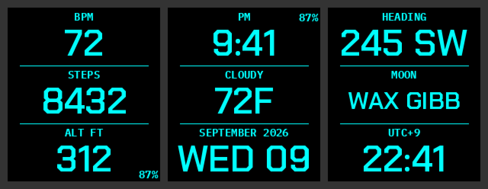

# pebble_deck_bigface

A three-panel, large-text fork of [pebble_deck](https://github.com/Keatr0n/pebble_deck) for the Pebble Time 2.

pebble_deck packs eight console lines onto the screen. pebble_deck_bigface keeps the same data sources and the
same cyberdeck colours, but shows only **three** of them, split top / middle / bottom, in text big enough to read
at a glance. There is no permanent clock — "Time" is just one of the things you can put in a panel.



Default layout: **Heart rate / Steps / Altitude**, with the battery percentage small in the bottom-right corner.

## Settings (phone app → watchface settings)

* **Top / Middle / Bottom panel** — pick from: Blank, Time, Date, Battery, Free memory, Compass heading,
  Heart rate, Steps, Weather, Altitude, Custom web API, Second timezone, Third timezone, Moon phase, HRV.
* **Show small captions** — the little label above each value (BPM, STEPS, …). Turn off for numbers only.
* **Show divider lines** — the thin lines between the panels.
* **Small battery % position** — Off, Top left, Top right, Bottom left, Bottom right.
* Colours, °F/°C, timezone offsets and the custom API settings work exactly as in pebble_deck.

Values automatically drop to a smaller font when they are too wide for the screen (e.g. "WAX GIBB",
"245 SW"), so nothing is ever cut off.

## Building

Requires the Pebble SDK (4.32 or newer for the HRV panel; older SDKs build fine, HRV just shows N/A).

```
pebble build
```

The face targets `emery` (Pebble Time 2, 200×228) like the original. It uses its own UUID and settings storage,
so it installs alongside pebble_deck rather than replacing it. To install without a developer account, copy
`build/pebble-deck-bigface.pbw` to your phone and open it — the Pebble app will offer to install it.

## Credits

All the data plumbing (weather via Open-Meteo, altitude, custom API, HRV RMSSD measurement, compass
power management) is [keatr0n](https://github.com/Keatr0n)'s work from pebble_deck; this fork only changes
what is drawn on the screen.
